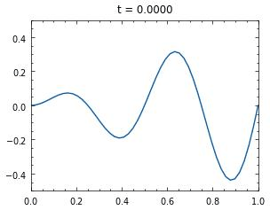

# 1D Finite Element Method Heat Equation Solver

This repository contains the code for a numerical solver of the 1D heat equation using Galerkin's Finite Element Method.

The FEM code is organized into two files, `bilinear_mesh.py` and `heat_equation.py`. 
- `bilinear_mesh.py` contains the code that represents a uniform mesh with bilinear elements.
- `heat_equation.py` contains the code directly related to solving the discretized heat equation using forward or backward euler time integration. 
These are seperated because in principle a mesh could be used to solve other PDEs and the heat equation solver can be used on non uniform meshes (with some further modifications).

In addition this repository contains two more files
- `Weak Form Derivation.pdf` , a hand derivation of the weak form statement of the heat equation problem.
- `demo.ipynb`, a demonstration of the forward and backward euler methods for solving the heat equation and experiments with time/spatial step size.